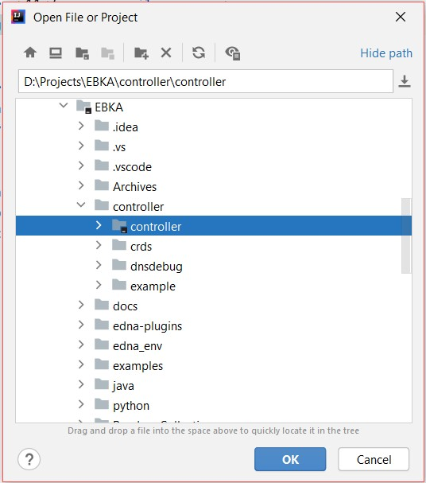
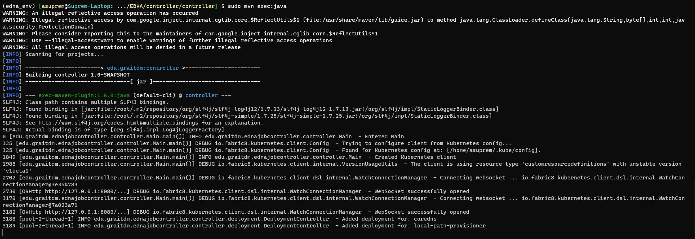

# Custom Resource Controller for EDNA Jobs

Now we will deploy a simple custom resource controller for EDNA Jobs. The controller we will deploy is mostly a stepping stone -- it only watches for EDNA Job resources and deploys a simple `busybox` pod in response. Your job is to extend it so that it does everything that `examples/generate_job_python.bash` does.

## Overview -- IDE

Since the controller is written in Java, it would be very useful to have a Java IDE for coding. I use [IntelliJ Community Edition](https://www.jetbrains.com/idea/download/). If you are comfortable with something else, feel free to use it.

Please note that the controller code uses Java 11 and Maven, so you will need them both. During IntelliJ installation, if it asks you for the JDK location, download JDK11, and then point to that binary. 

[Here are some instructions for macOS](https://guides.codepath.com/android/setting-up-intellij-idea). You simply have to switch out Java 8 for Java 11. I prefer [OpenJDK11](https://openjdk.java.net/projects/jdk/11/).

[You can also use this link](https://www.jetbrains.com/help/idea/sdk.html#openjdk-list), which provides excellet steps. Basically, you install IntelliJ, and then set up a JDK for a project. It's likely when you load the controller project, IntelliJ will automatically set up Java 11 for you, but I am not sure.

It's been a while since I installed IntelliJ, so I forget whether it comed bundled with Maven or whether you have to select it during installation, so keep an eye out!

## Overview -- Loading the project
Once you have set up IntelliJ, load the project in IntelliJ with **File -> Open**, then select the `/path/to/repo/controller/controller` folder:



Once project is loaded, you also need to install the `lombok` plugin -- see the [second and first answers here, respectively](https://stackoverflow.com/questions/41161076/adding-lombok-plugin-to-intellij-project#:~:text=To%20add%20the%20Lombok%20IntelliJ%20plugin%20to%20add,Click%20on%20Install%20plugin%205%20Restart%20IntelliJ%20IDEA).


## Overview -- Configurations

To make it easier to debug, we can set up build and execution configurations. Near the top right, there is an **Edit Configurations** dropdown:


Select this, then in the window, add two configurations. First click  **Add New Configuration** using the **+** symbol in the top left and use Maven. Then in the *Command line*, type `exec:java`. Then click the **+** symbol again, use Maven, and type `clean install`. Then click **Ok**.

You can switch configurations with the dropdown, once you have exited the dialogue box.

The `clean install` is used to clean and rebuild the package. The `exec:java` is to execute program. You can directly run the configuration with green triangle to the right of the configuration dropdown. The little green bug to the right of the triangle is for debugging. When running an application, all breakpoints will be ignored. When debugging, you can use breakpoints. (Debugging with the `clean install` configuration isn't very useful, by the way.)

## Testing the code -- Prerequisites
First build the project with the `clean install` configuration. 

Then, we need a couple of prereqs. Do the following:

1. Set up a cluster with registry.
2. Apply the custom resource definition in `/repo/controller/crds/ednajob.yaml`:

```
kubectl apply -f ednajob.yaml
```

3. Create an application namespace for ouy examples:

```
kubectl create namespace app1
```

This is for the example applications. In the final deliverables, you will programatically create namespaces -- one for each application deployed in EDNA, provided through the `applicationname` field in the CRD.

4. Add `busybox` to the registry from Part 3's **Testing the Registry** section.

5. Set up a kubeproxy to allow access to the cluster from java:

```
kubectl proxy --port=8080
```

If using a VirtualMachine and are getting a connection error in the Java Code try:
```
sudo kubectl proxy --address='0.0.0.0' --port=8080
```

and pass the IPV4 Address of your java VM as an argument when executing the script (see next section)

## Testing the code
If you need to pass arguments, you need to modify the `exec:java` configuration. The following options are current available:

- `--kubectl-port` : The port for the kubectl proxy. Default is "8080"
- `--kubectl-host` : The host for the kubectl proxy. Default is "127.0.0.1". If you are using a VM, then use the IPV4 addressof your java VM as an argument.
- `--kubectl-protocol` : The connection protocol for the kubectl proxy. Default is "http". Replace with "https" is using "https"

To pass the `--kubectl-host` argument with exec:java, you need to replace `exec:java` in IntelliJ's **Debug Configuration**'s *Command Line* with:

```
 exec:java -Dexec.args="--kubectl-host 123.4.5.6"
```

Now run the code with the `exec:java` (or `exec:java` with arguments) configuration.


You can do this a couple ways, actually. You can do this through IntelliJ with the green triangle **run** button next to the **Debug Configurations** dropdown (or the green **debug** button), or through your terminal. 

If you choose to use the terminal, you will need to set up the toolchain. This should be fairly straightforward, so I won't go into detail here. Baically install [openjdk11](https://www.ubuntu18.com/ubuntu-install-openjdk-11/), then install [maven](https://linuxize.com/post/how-to-install-apache-maven-on-ubuntu-18-04/#:~:text=Install%20the%20Latest%20Release%20of%20Apache%20Maven.%201,environment%20variables.%204%204.%20Verify%20the%20installation.%20) and make sure it points to the jdk installation through `JAVA_HOME`. To build in terminal you need to run `mvn clean install` from inside the `/repo/controller/controller` directory, then `mvn exec:java` (or `mvn exec:java -Dexec.args="--kubectl-host 123.4.5.6"`). Note -- you *might* need to use `sudo`.

Once you have executed it, in the IntelliJ console or in terminal, you will get several Log messages similar to below:



## Testing the controller
While the controller is running, on another terminal, cd into `repo/controller/example`. Then:

```
kubectl apply -f ednajob1.yaml
```

Back on the controller window/console, you should see something like:

```
117773 [pool-1-thread-1] INFO edu.graitdm.ednajobcontroller.controller.ednajob.EdnaJobController  - ADD EdnaJob - job1
117859 [pool-1-thread-1] INFO edu.graitdm.ednajobcontroller.controller.ednajob.EdnaJobFactory  - UPD - job1 -- patching EdnaJob with updated state
117930 [pool-1-thread-1] INFO edu.graitdm.ednajobcontroller.controller.ednajob.EdnaJobController  - MOD EdnaJob - job1
117943 [pool-1-thread-1] INFO edu.graitdm.ednajobcontroller.controller.ednajob.EdnaJobController  - MOD - DEPLOYMENT_CREATION -- job1
117943 [pool-1-thread-1] INFO edu.graitdm.ednajobcontroller.controller.deployment.DeploymentFactory  - Adding deployment for - job1
118172 [pool-1-thread-1] INFO edu.graitdm.ednajobcontroller.controller.deployment.DeploymentFactory  - Set up deployment
118190 [pool-1-thread-1] INFO edu.graitdm.ednajobcontroller.controller.deployment.DeploymentFactory  - Applied deployment
118190 [pool-1-thread-1] INFO edu.graitdm.ednajobcontroller.controller.deployment.DeploymentFactory  - Added deployment for - job1
118250 [pool-2-thread-1] INFO edu.graitdm.ednajobcontroller.controller.deployment.DeploymentController  - Added deployment for: job1
118252 [pool-2-thread-1] INFO edu.graitdm.ednajobcontroller.controller.deployment.DeploymentController  - Modified deployment for: job1
118258 [pool-2-thread-1] INFO edu.graitdm.ednajobcontroller.controller.deployment.DeploymentController  - Modified deployment for: job1
118269 [pool-2-thread-1] INFO edu.graitdm.ednajobcontroller.controller.deployment.DeploymentController  - Modified deployment for: job1
119483 [pool-2-thread-1] INFO edu.graitdm.ednajobcontroller.controller.deployment.DeploymentController  - Modified deployment for: job1
```

The controller as it is just launches a busybox deployment for each job we apply (you would need to update this to launch a deployment tha takes in the docker image for the job from the registry). It will apply this deployment in a namespace that matches the edna job's application name (in this case, check the `ednajob1.yaml` -- it is "app1") So you can verify with:


```
[asuprem@Suprem-Laptop: .../EBKA/controller/example] $ kubectl get deployments -n app1
NAME   READY   UP-TO-DATE   AVAILABLE   AGE
job1   1/1     1            1           89s
```

Now delete the custom resource we applied with:

```
kubectl delete -f ednajob1.yaml
```

You should get the following additional messages from the controller program

```
284837 [pool-1-thread-1] INFO edu.graitdm.ednajobcontroller.controller.ednajob.EdnaJobController  - DEL EdnaJob - job1
284853 [pool-1-thread-1] INFO edu.graitdm.ednajobcontroller.controller.ednajob.EdnaJobFactory  - UPD - job1 -- patching EdnaJob with updated state
284953 [pool-2-thread-1] INFO edu.graitdm.ednajobcontroller.controller.deployment.DeploymentController  - Modified deployment for: job1
284969 [pool-2-thread-1] INFO edu.graitdm.ednajobcontroller.controller.deployment.DeploymentController  - Modified deployment for: job1
284998 [pool-2-thread-1] INFO edu.graitdm.ednajobcontroller.controller.deployment.DeploymentController  - Modified deployment for: job1
285037 [pool-1-thread-1] INFO edu.graitdm.ednajobcontroller.controller.deployment.DeploymentFactory  - Deleted deployment for - job1
285038 [pool-2-thread-1] INFO edu.graitdm.ednajobcontroller.controller.deployment.DeploymentController  - Deleted deployment for: job1
```

You can verify the deployment is automatically deleted with:

```
[asuprem@Suprem-Laptop: .../EBKA/controller/example] $ kubectl get deployments -n app1
No resources found in app1 namespace.
```

# Replicating the Job generator script

We can take this piece by piece. 

## Step 1 -- Creating a Deployment
First, run the job generator script from Part 6. This will push an image to the registry.

Then create a custom resource that defines this job, using the custom resource definition (should be fairly straightforward), then update `src/main/java/edu/graitdm/ednajobcontroller/controller/deployment/DeploymentFactory.java` to create a deployment with the proper values for image tag, deployment name, etc.

## Step 2 -- Creating a Namespace
Update the `EdnaJobController.java`'s *DEPLOYMENT_CREATION* state to check, when we receive a custom resource, to check if the associated namespace from the `applicationname` field exists. If it does not, create it, then proceed to create deployment as before.

Then, modify `onDeletion()` function to check, upon a ednajob deletion, whether it is the last one in its `applicationname`. If so, delete the associated namespace.

## Step 3 -- Docker
Now you will need to replace the docker parts of the script. You will need to use a docker library for java. Then, given a custom resource, use the docker library to create the associated image and push it to a registry. Then continue as before.

We will make the assumption that given a custom resource, the python program associated with that resource is located in `current_directory/ednajobs/<applicationname>/<jobname>/<filename>.py`. This will also involve creating an `ednaconf.yaml`, saving it to disk, creating a `.dockerignore`, and deleting these extraneous files once the image is created. The `ednaconf.yaml`'s fields will need to be populated by the `jobvariablenames` and `jobvariablevalues` fields of the custom resource.
